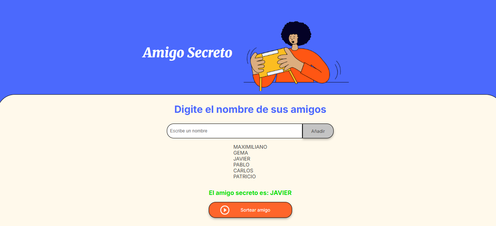

# 🎉 Amigo Secreto - Organizador de Sorteos

 <!-- Ruta actualizada -->

Aplicación web intuitiva para organizar sorteos de "Amigo Secreto" ideal para eventos familiares, reuniones de trabajo o fiestas con amigos.

## ✨ Características destacadas

- 🎯 **Agregado sencillo**: Añade nombres con un clic o usando Enter
- 📌 **Listado dinámico**: Visualización instantánea de participantes
- 🎰 **Algoritmo justo**: Selección aleatoria verificable
- 📱 **Adaptable**: Diseño optimizado para todos los dispositivos
- ⚡ **Rendimiento**: Sin dependencias externas de JavaScript

## 🚀 Primeros pasos

### Requisitos
- Navegador moderno (Chrome 90+, Firefox 88+, Safari 14+)
- Conexión a internet (para fuentes Google)

### Instalación
```bash
git clone https://github.com/MaxiFlorez/amigo-secreto.git
cd amigo-secreto
